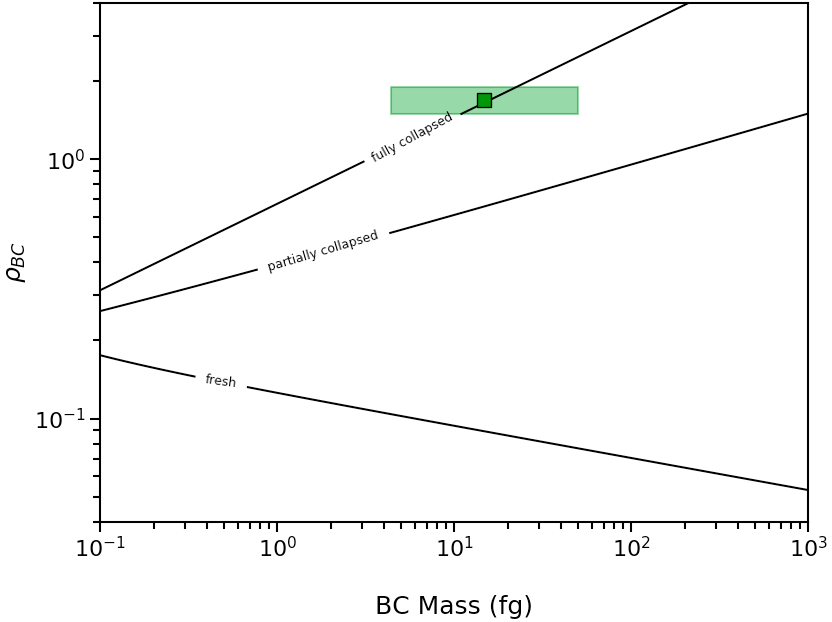
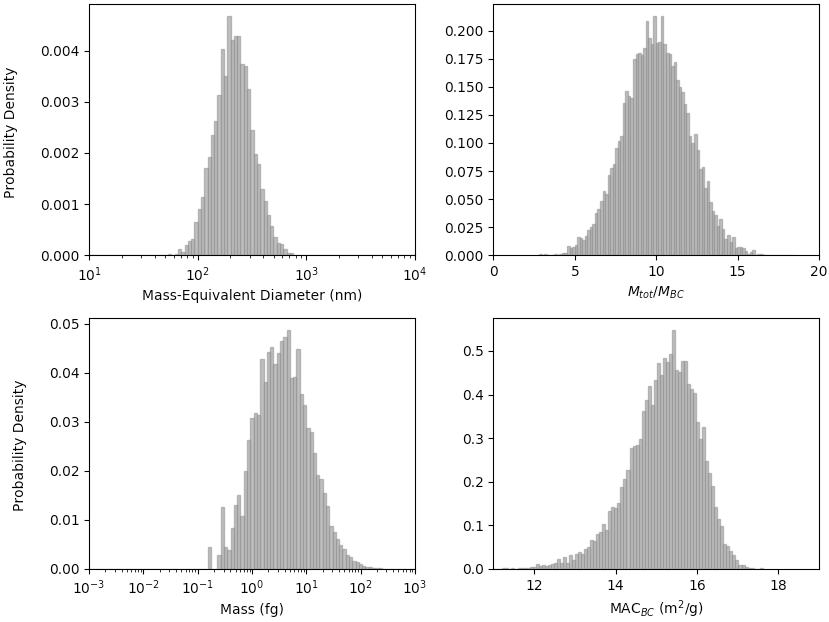

.. highlight:: python

Example Scripts
======================================

Morphology of of a Single Black Carbon Particle
-------------------------------------------------

To infer the morphology of a single BC particle, use the :py:func:`abs2shape_SP` function. This example shows a particle with mass-equivalent diameter of 250nm, M\ :sub:`tot`/M\ :sub:`BC` of 10, and MAC\ :sub:`BC` of 12.5 m\ :sup:`2`/g measured at 532 nm, coated with non-absorbing material.

.. code-block:: pycon
   
   >>> import pyBCabs.retrival as pyBCabs
   >>> pyBCabs.abs2shape_SP(250, 10, 12.5, 532, k_coat=0.00, ReturnPlot=False, PlotPoint=True)
   {'mass': 14.726215563702151,
   'rho_lower': 1.6958737655127754,
   'rho': 1.6958737655127754,
   'rho_upper': 1.6958737655127754}

This particle has :math:`{\rho}`\ :sub:`BC` > 1, and generates this morphology plot:

.. image:: images/ex1a.png

If the measured MAC\ :sub:`BC` were 15 m\ :sup:`2`/g, then 0 < :math:`{\rho}`\ :sub:`BC` < 1, and this morphology plot will be generated:

.. image:: images/ex1b.png

If you wish to plot multiple particle-resolved measurements, this can also be done using the :py:func:`abs2shape_SP` function. 

.. code-block:: pycon
   
   wl=532 #wavelength
   dp=np.logspace(np.log10(150),np.log10(250),10) #example BC mass-equivalent diameter measurements
   M=10 #coating amount
   p_avg=np.zeros(len(dp))
   lower=np.zeros(len(dp))
   upper=np.zeros(len(dp))
   mass=np.zeros(len(dp))
        
   fig, ax, result = pyBCabs.abs2shape_SP(1, M, 6.4, wl, k_coat=0.0, abs_error=1.0, ReturnPlot=True, PlotPoint=False)
    
   for i in range(0,len(dp)):
        
       MAC=np.random.normal(0.8,0.1)*15
       result=pyBCabs.abs2shape_SP(dp[i], M, MAC, wl, k_coat=0.0, abs_error=1.0, ReturnPlot=False, PlotPoint=False)
       mass[i]=result['mass']
       p_avg[i]=result['rho']
       lower[i]=result['rho']-result['rho_lower']
       upper[i]=result['rho_upper']-result['rho']

   errors=np.row_stack((lower,upper))
   ax.errorbar(mass, p_avg, yerr=errors, markersize=7, fmt = 's', mfc='b', mec = 'k', capsize=4, ecolor = 'b', elinewidth=1.5, mew=1.5)
   plt.show()
    
The above code will generate a plot similar to this:

.. image:: images/ex1c.png

Absorption of of a Single Black Carbon Particle
-----------------------------------------

To calculate MAC\ :sub:`BC` of a single particle, use the :py:func:`shape2abs_SP` function. This example shows a partially collapsed BC particle with mass-equivalent diameter of 250nm and M\ :sub:`tot`/M\ :sub:`BC` of 10, calculated at 532 nm, with non-absorbing coating.

.. code-block:: pycon
   
   >>> import pyBCabs.retrival as pyBCabs
   >>> pyBCabs.shape2abs_SP(250, 10, 'partial', 532, k_coat=0.00, mode='MtotMbc', r_monomer=20, asDict=True)
   {'dp': 250,
   'coating': 10,
   'MAC': 15.270921290660958}
   
Morphology of Black Carbon Size Distribution
-------------------------------------------------

To infer the morphology of a lognormal size distribution of black carbon particles, use the :py:func:`abs2shape_SD` function. This example shows a distribution of black carbon with geometric mean mass-equivalent diameter of 250nm, geometric standard deviation of 1.5, M\ :sub:`tot`/M\ :sub:`BC` of 10, and MAC\ :sub:`BC` of 12.5 m\ :sup:`2`/g measured at 532 nm, with non-absorbing coating. 
   
.. code-block:: pycon
   
   >>> import pyBCabs.retrival as pyBCabs
   >>> pyBCabs.abs2shape_SD(250, 1.5, 10, 12.5, 532, k_coat=0.0, abs_error=1.0, ReturnPlot=True)
   <Figure size 832x624 with 1 Axes>, 
   <matplotlib.axes._subplots.AxesSubplot object at 0x119e22e80>, 
   {'min_mass': 4.363323129985816, 
   'avg_mass': 14.726215563702134, 
   'max_mass': 49.70097752749473, 
   'rho_lower': 1.4961402652726399, 
   'rho': 1.6958737655127754, 
   'rho_upper': 1.9011038545429513}
    >>> plt.show()
    
The above code will generate the following plot:

Absorption of of a Black Carbon Size Distribution
-----------------------------------------

To calculate MAC\ :sub:`BC` of a lognormal black carbon size distribution, use the :py:func:`shape2abs_SD` function. This example shows a partially collapsed black carbon size distribution with geometric mean mass-equivalent diameter of 250nm, geometric standard deviation of 1.5, and M\ :sub:`tot`/M\ :sub:`BC` of 10 (with standard deviation of 2), calculated at 532 nm, with non-absorbing coating.

.. code-block:: pycon
   
   >>> import pyBCabs.retrival as pyBCabs
   >>> pyBCabs.shape2abs_SD(250, 1.5, 10, 2, 'partial', 532, k_coat=0.00, mode='MtotMbc', r_monomer=20, DataPoints=False, ShowPlots=True)
   {'dp_avg': 271.1435259574555, 
   'dp_stdev': 115.42341830345885, 
   'coating_avg': 9.989282292286155, 
   'coating_stdev': 1.9791873855346263, 
   'MAC_avg': 15.165034433016245, 
   'MAC_std': 0.8543285503019649}
   
The following plot is also generated:

