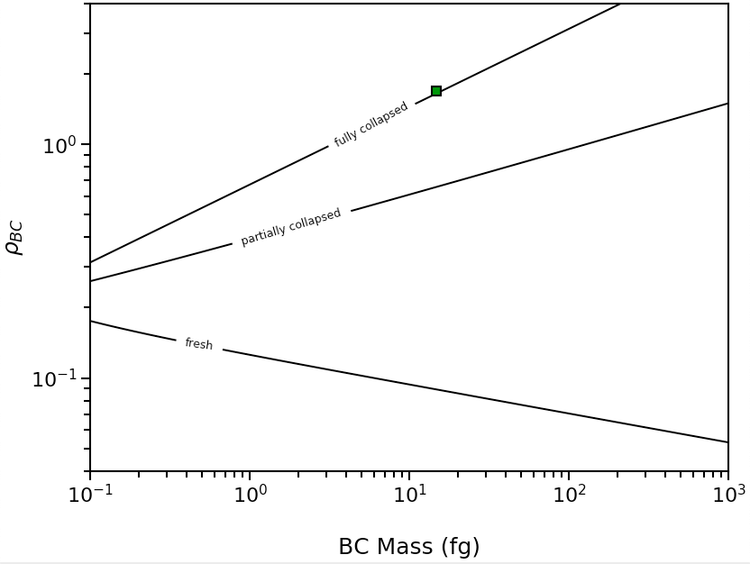

.. highlight:: python

Example Scripts
======================================

Morphology of of a Single Black Carbon Particle
-------------------------------------------------

To infer the morphology of a single BC particle, use the :py:func:`abs2shape_SP` function. This example shows a particle with volume-equivalent diameter of 250nm, M\ :sub:`tot`/M\ :sub:`BC` of 10, and MAC\ :sub:`BC` of 12.5 m\ :sup:`2`/g measured at 532 nm.

.. code-block:: pycon
   
   >>> import pyBCabsorption as pbca
   >>> pbca.abs2shape_SP(10,12.5,532,250,ReturnPlot=False,PlotPoint=True)
   {'mass': 14.726215563702151,
   'rho_lower': 1.6958737655127754,
   'rho': 1.6958737655127754,
   'rho_upper': 1.6958737655127754}

This particle has With the following image:

Mie Efficencies of a Weibull Distribution
-----------------------------------------

