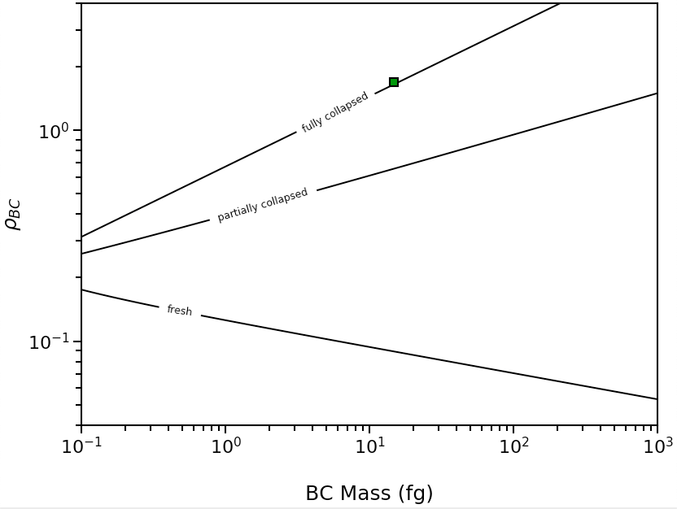
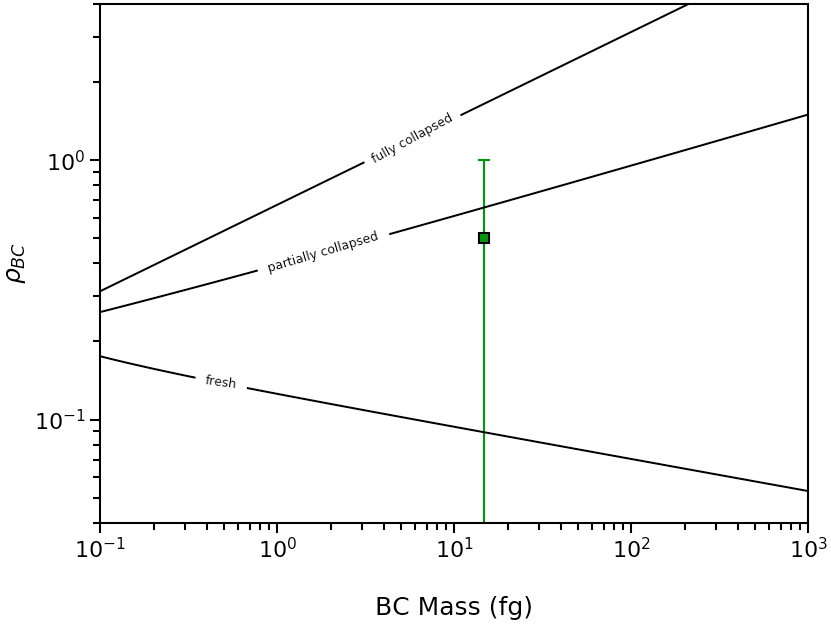
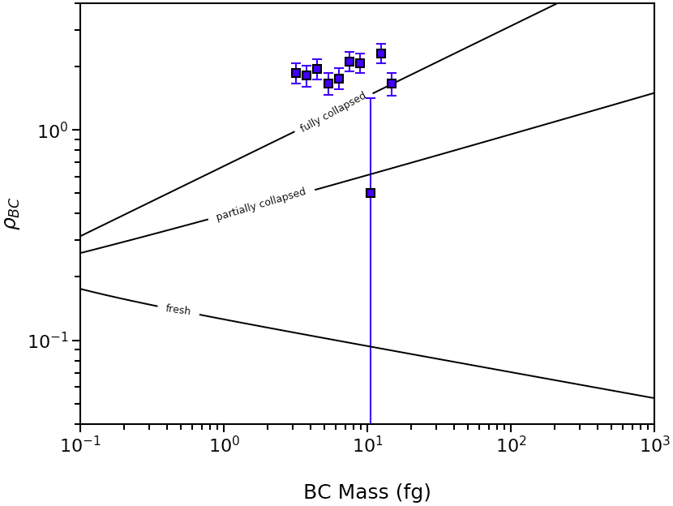

.. highlight:: python

Example Scripts
======================================

Morphology of of a Single Black Carbon Particle
-------------------------------------------------

To infer the morphology of a single BC particle, use the :py:func:`abs2shape_SP` function. This example shows a particle with volume-equivalent diameter of 250nm, M\ :sub:`tot`/M\ :sub:`BC` of 10, and MAC\ :sub:`BC` of 12.5 m\ :sup:`2`/g measured at 532 nm.

.. code-block:: pycon
   
   >>> import pyBCabsorption as pbca
   >>> pbca.abs2shape_SP(10,12.5,532,250,ReturnPlot=False,PlotPoint=True)
   {'mass': 14.726215563702151,
   'rho_lower': 1.6958737655127754,
   'rho': 1.6958737655127754,
   'rho_upper': 1.6958737655127754}

This particle has :math:`{\rho}`\ :sub:`BC` > 1, and generates this morphology plot:

If the measured MAC\ :sub:`BC` were 15 m\ :sup:`2`/g, then 0 < :math:`{\rho}`\ :sub:`BC` < 1, and this morphology plot will be generated:

If you wish to plot multiple particle-resolved measurements, this can also be done using the :py:func:`abs2shape_SP` function. 

.. code-block:: pycon
   
   wl=532 #wavlength
   dp=np.logspace(np.log10(150),np.log10(250),10) #example BC diameter measurements
   M=10 #coating amount
   p_avg=np.zeros(len(dp))
   lower=np.zeros(len(dp))
   upper=np.zeros(len(dp))
   mass=np.zeros(len(dp))
        
   fig, ax, result = pbca.abs2shape_SP(1,5,wl,250,abs_error=1.0,ReturnPlot=True,PlotPoint=False)
    
   for i in range(0,len(dp)):
        
       MAC=np.random.normal(0.8,0.1)*15
       result=pbca.abs2shape_SP(M,MAC,wl,dp[i],abs_error=1.0,ReturnPlot=False,PlotPoint=False)
       mass[i]=result['mass']
       p_avg[i]=result['rho']
       lower[i]=result['rho']-result['rho_lower']
       upper[i]=result['rho_upper']-result['rho']

   errors=np.row_stack((lower,upper))
   ax.errorbar(mass, p_avg, yerr=errors, markersize=7, fmt = 's', mfc='b', mec = 'k', capsize=4, ecolor = 'b', elinewidth=1.5, mew=1.5)
   plt.show()
    
The above code will generate a plot similar to this:

Absorption of of a Single Black Carbon Particle
-----------------------------------------

To calculate MAC\ :sub:`BC` of a single particle, use the :py:func:`shape2abs_SP` function. This example shows a partially collapsed BC particle with volume-equivalent diameter of 250nm and M\ :sub:`tot`/M\ :sub:`BC` of 10, calculated at 532 nm.

.. code-block:: pycon
   
   >>> import pyBCabsorption as pbca
   >>> pbca.shape2abs_SP(250, 10, 532, 'partial', mode='MtotMbc', r_monomer=20, asDict=True)
   {'dp': 250,
   'coating': 10,
   'MAC': 15.270921290660958}
   
   
   
